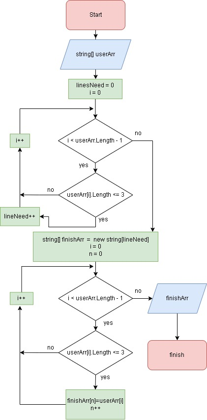

# Итоговая работа по первому блоку
# Беляев АЛ
### Задание итоговой рабботы:
1. Создать репозиторий GitHab 
2. Нарисовать блок-схему алгоритма
3. Снабдить репозиторий оформленным файлом README.md
4. Написать программу, решающую поставленную задачу
5. Использовать контроль версий, в работе над этим проектом, чтобы все было не одним коммитом а как минимум разбиты по этапам 2, 3 и 4
___________
## Основная задача:
### Написать программу, которая из имеющегося массива строк формирует массив из строк, длинна которых меньше либо ровна 3 символам. Первоначальный массив можно ввести с клавиатуры, либо задать на старте выполнения алгоритма. При решении не рекомендуется пользоваться коллекциями, лучше обойтись исключительно массивами.
________________
## Блок схема логики выполнения основной задачи.

в gitignire добавленно все кроме 
* Program.cs 
* README
